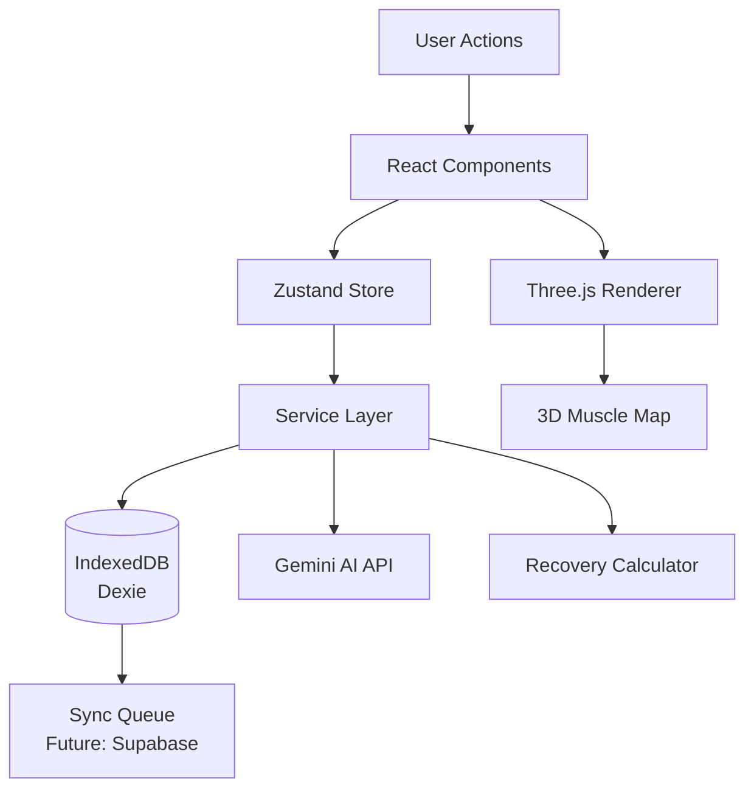

# FitTrackAI: Advanced Gym Exercise Tracker - Complete Implementation Plan

## Architecture Overview

The application follows a mobile-first PWA architecture with offline-first data storage, real-time muscle recovery tracking, and AI-powered workout insights.

### Technology Stack

- **Frontend**: React 18+ with TypeScript, Vite
- **State Management**: Zustand
- **Styling**: Tailwind CSS
- **3D Visualization**: Three.js with React Three Fiber
- **Charts**: Recharts
- **Database**: IndexedDB (Dexie.js) - local storage only initially
- **AI**: Gemini AI API
- **PWA**: Workbox service workers
- **Utilities**: date-fns, Lucide React icons

### Data Flow Architecture




## Project Structure

```javascript
src/
├── components/
│   ├── layout/          # BottomNavigation, Header, Layout
│   ├── exercise/        # ExerciseLogger, ExerciseCard, SetInput, etc.
│   ├── anatomy/         # MuscleMap (Three.js), MuscleDetail, RecoveryIndicator
│   ├── analytics/       # ProgressCharts, VolumeChart, HeatmapCalendar
│   ├── insights/        # AIInsightsPanel, RecommendationCard
│   └── common/          # Button, Modal, LoadingSpinner, Toast
├── pages/               # Home, LogWorkout, Anatomy, Analytics, Insights, Settings
├── hooks/               # useWorkouts, useMuscleRecovery, useAnalytics, useAIInsights
├── services/            # database, exerciseLibrary, muscleMapping, recoveryCalculator, aiService
├── store/               # workoutStore, userStore, settingsStore (Zustand)
├── types/               # exercise, muscle, workout, analytics (TypeScript interfaces)
└── utils/               # calculations, dateHelpers, validators
```


## Implementation Phases

### Phase 1: MVP Foundation (Weeks 1-3)

#### 1.1 Project Setup & Configuration

- Initialize Vite + React + TypeScript project
- Configure Tailwind CSS with custom theme (recovery colors, animations)
- Set up Zustand stores structure
- Configure Dexie.js for IndexedDB
- Set up Three.js and React Three Fiber
- Configure PWA manifest and service worker basics
- Set up routing (React Router)

**Key Files:**

- `package.json` - Dependencies: react, react-dom, typescript, vite, zustand, dexie, three, @react-three/fiber, @react-three/drei, recharts, tailwindcss, date-fns, lucide-react, workbox
- `vite.config.ts` - Vite configuration with PWA plugin
- `tailwind.config.js` - Custom theme with recovery colors
- `tsconfig.json` - TypeScript strict mode configuration

#### 1.2 Core Type Definitions

Create comprehensive TypeScript interfaces in `src/types/`:

- `exercise.ts` - Exercise, WorkoutSet, WorkoutExercise interfaces
- `muscle.ts` - MuscleGroup enum, MuscleStatus, RecoverySettings
- `workout.ts` - Workout interface
- `analytics.ts` - Analytics data structures

#### 1.3 Database Layer

- Implement `src/services/database.ts` with Dexie schema
- Define tables: workouts, exercises, muscleStatuses, settings
- Create database migration system
- Implement basic CRUD operations

#### 1.4 Basic Exercise Library

- Create `src/services/exerciseLibrary.ts`
- Pre-populate with 20 core exercises (bench press, squat, deadlift, etc.)
- Exercise-to-muscle mapping structure
- Search and filter functionality

#### 1.5 Basic Workout Logging

- `src/pages/LogWorkout.tsx` - Main workout logging page
- `src/components/exercise/ExerciseSelector.tsx` - Exercise search/select
- `src/components/exercise/SetInput.tsx` - Reps/weight input with +/- buttons
- `src/components/exercise/ExerciseCard.tsx` - Display logged exercises
- Basic workout save to IndexedDB

#### 1.6 Simple Muscle Map (Three.js Foundation)

- `src/components/anatomy/MuscleMap.tsx` - Three.js scene setup
- Basic 3D human model (using @react-three/drei Human model or custom)
- Muscle group selection via raycasting
- Color coding system (green/yellow/orange/red/gray)
- Front/back view toggle

#### 1.7 Basic Analytics

- `src/pages/Analytics.tsx` - Analytics page structure
- `src/components/analytics/VolumeChart.tsx` - Simple volume line chart
- `src/components/analytics/HeatmapCalendar.tsx` - Workout frequency heatmap
- Basic PR tracking display

#### 1.8 Layout & Navigation

- `src/components/layout/Layout.tsx` - Main app layout
- `src/components/layout/BottomNavigation.tsx` - Mobile navigation
- `src/components/layout/Header.tsx` - Page headers
- `src/pages/Home.tsx` - Dashboard with quick stats

### Phase 2: Core Features (Weeks 4-6)

#### 2.1 Comprehensive Exercise Library

- Expand to 100+ exercises in `src/services/exerciseLibrary.ts`
- Categories: strength, cardio, flexibility, olympic, plyometric
- Equipment filters
- Difficulty levels
- Custom exercise creation
- Favorites system
- Recent exercises quick access

#### 2.2 Advanced Workout Logging

- Rest timer with auto-start (`src/components/exercise/RestTimer.tsx`)
- RPE (Rate of Perceived Exertion) slider
- Notes per set
- Previous workout data display
- Swipe-to-delete sets
- Workout templates
- Superset/circuit support
- Auto-save every 10 seconds

#### 2.3 Detailed Muscle Anatomy

- Complete muscle group mapping (20+ muscles)
- `src/services/muscleMapping.ts` - Comprehensive exercise-to-muscle mapping
- Detailed muscle selection in 3D model
- Muscle detail panel with:
- Last workout date
- Recovery countdown
- Volume last 7 days
- Training frequency
- Suggested exercises

#### 2.4 Recovery Calculation System

- `src/services/recoveryCalculator.ts` - Recovery algorithm
- `src/hooks/useMuscleRecovery.ts` - Recovery status hook
- Calculate recovery based on:
- Time since last workout
- Workload score (volume × intensity)
- User experience level
- Muscle-specific recovery times
- Real-time recovery status updates

#### 2.5 Advanced Analytics

- `src/components/analytics/ProgressCharts.tsx` - PR timeline with markers
- `src/components/analytics/MuscleDistribution.tsx` - Pie chart
- `src/components/analytics/StrengthChart.tsx` - Strength progression
- Balance radar chart
- Exercise performance table
- Time analysis charts
- Export to CSV functionality

#### 2.6 Workout Templates

- Template creation and management
- Quick start from templates
- "Repeat Last Workout" functionality
- Pre-filled exercises based on muscle recovery

### Phase 3: Advanced Features (Weeks 7-9)

#### 3.1 AI Insights Integration

- `src/services/aiService.ts` - Gemini AI integration
- `src/hooks/useAIInsights.ts` - AI insights hook
- `src/pages/Insights.tsx` - Insights page
- `src/components/insights/AIInsightsPanel.tsx` - Main insights display
- Features:
- Daily insight generation
- Workout plan recommendations
- Plateau detection
- Form check reminders
- Periodization suggestions
- Injury risk assessment
- Context-aware prompts with workout history

#### 3.2 Rest Timer Enhancements

- Notification API integration
- Sound alerts
- Vibration feedback
- Background timer support
- Custom rest durations per exercise

#### 3.3 Voice Input

- `src/hooks/useVoiceInput.ts` - Web Speech API integration
- Voice command parsing ("10 reps at 50 kilograms")
- Hands-free set logging
- Voice input button in SetInput component

#### 3.4 Plate Calculator

- `src/components/common/PlateCalculator.tsx`
- Visual barbell representation
- Configurable plate sizes
- Per-side calculation
- Integration in SetInput

#### 3.5 PWA Optimization

- Complete service worker setup (`src/service-worker.ts`)
- Workbox strategies (NetworkFirst, CacheFirst)
- Offline functionality testing
- App shortcuts
- Install prompts
- Background sync queue

#### 3.6 Settings & Customization

- `src/pages/Settings.tsx` - Comprehensive settings page
- User profile management
- Workout preferences
- Recovery settings (custom rest days)
- Notification preferences
- Display settings (dark mode, theme)
- Data management (export/import)

### Phase 4: Polish & Optimization (Weeks 10-11)

#### 4.1 Onboarding Flow

- Welcome screens
- Experience level selection
- Goals selection
- Equipment selection
- Workout frequency setup
- Interactive tutorial overlay

#### 4.2 Animations & Micro-interactions

- Framer Motion for page transitions
- Celebration animations for PRs
- Swipe gestures with haptic feedback
- Pull-to-refresh
- Loading skeletons
- Smooth chart animations

#### 4.3 Performance Optimization

- Code splitting with React.lazy
- Virtualization for long lists (react-window)
- Memoization of expensive components
- Debounced search
- Optimistic UI updates
- Image optimization (WebP)
- Bundle size optimization

#### 4.4 Dark Mode

- Theme provider
- System preference detection
- Smooth theme transitions
- Three.js scene lighting adjustments

#### 4.5 Testing

- Unit tests (Vitest + React Testing Library)
- Integration tests for workout flows
- E2E tests (Playwright) for critical paths
- Recovery calculation tests
- AI service mock tests

#### 4.6 Accessibility

- ARIA labels
- Keyboard navigation
- Screen reader support
- Focus management
- Color contrast compliance

#### 4.7 Documentation

- README with setup instructions
- Component documentation
- API documentation for services
- User guide

## Key Implementation Details

### Three.js Muscle Map Architecture

```typescript
// src/components/anatomy/MuscleMap.tsx
// Uses @react-three/fiber and @react-three/drei
// - Human model from drei or custom GLTF
// - Muscle groups as separate meshes with onClick handlers
// - Color materials based on recovery status
// - Camera controls (OrbitControls) with mobile support
// - Raycasting for muscle selection
// - Smooth transitions between front/back views
```


### Recovery Calculation Algorithm

```typescript
// src/services/recoveryCalculator.ts
// Base recovery times per muscle group and experience level
// Factors: hours since workout, workload score, intensity
// Returns: recovery percentage, status, recommended rest days
```


### AI Service Integration

```typescript
// src/services/aiService.ts
// Gemini API client
// Context building from workout history
// Structured prompt templates
// Response parsing and validation
// Error handling and fallbacks
```


### Offline-First Data Flow

```typescript
// All writes go to IndexedDB immediately
// Optimistic UI updates
// Background sync queue for future Supabase integration
// Conflict resolution strategy
```


## Success Criteria

- Initial load < 2 seconds
- Time to Interactive < 3 seconds
- 60fps animations
- 100% offline functionality
- Zero data loss
- Lighthouse PWA score > 90
- Workout logging < 60 seconds
- AI insights < 5 seconds generation time

## Future Enhancements (Post-MVP)

- Supabase sync for cloud backup